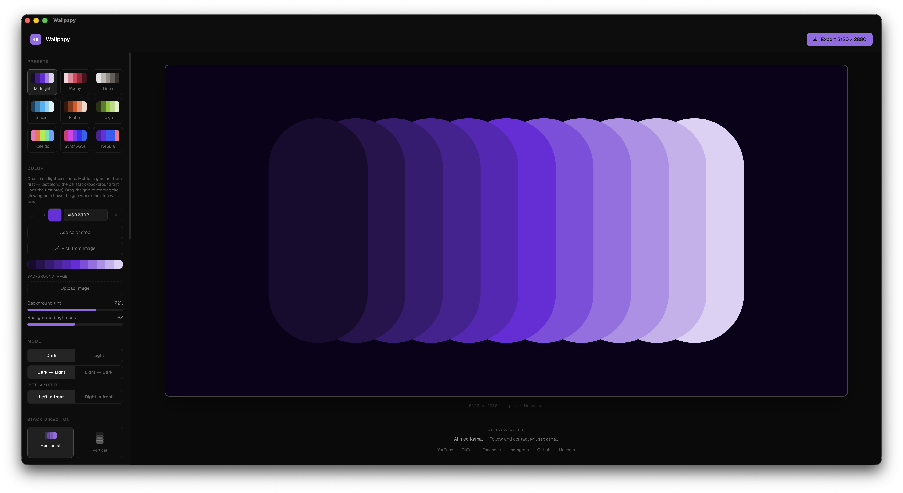
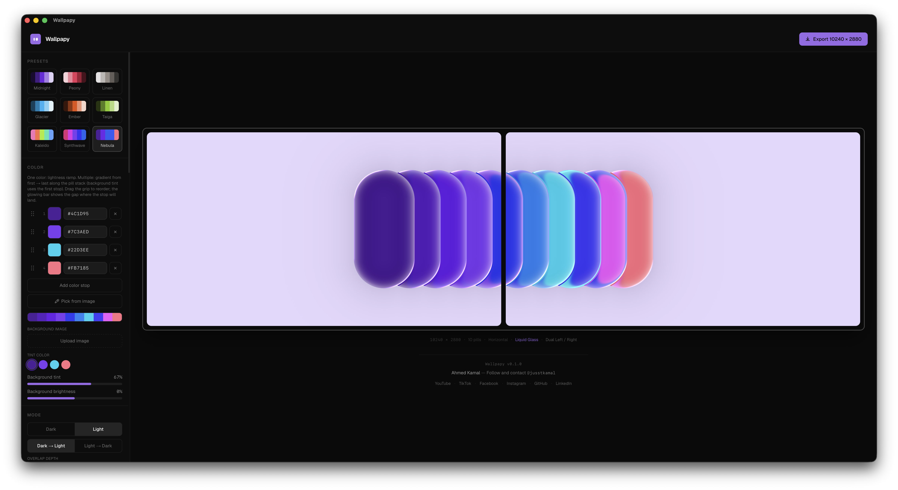
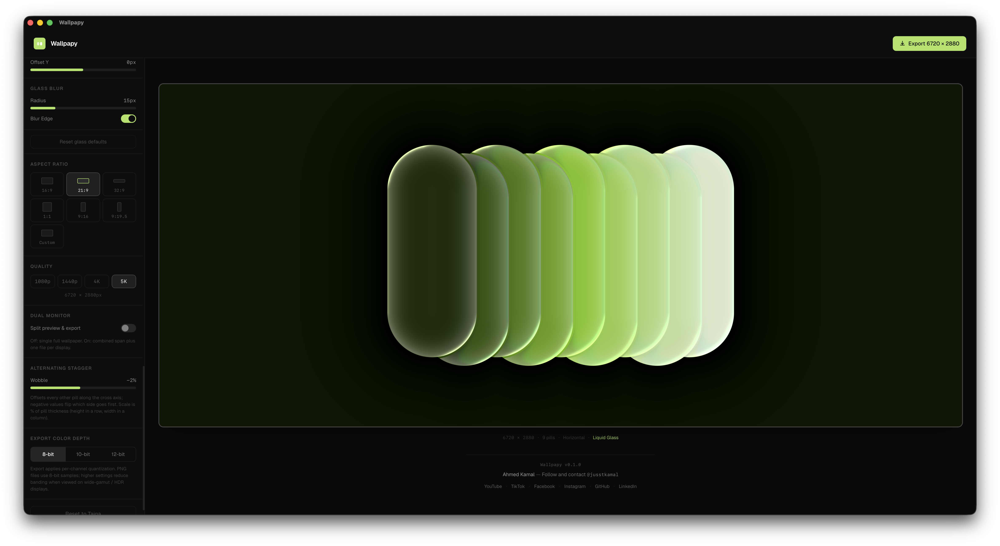

# Wallpapy

> _Wallpaper + Pappy. Built the day my son Hamza was born. Love you, buddy. 🍼_

---

## Vibe Coded — Heads Up

This app is, very clearly, vibe coded. It was built in a single day on almost no sleep. It works, and it works pretty well — but it's not perfect. There are probably bugs, rough edges, and things that make a senior dev's eye twitch. The desktop version in particular may have some quirks. Use it, enjoy it, and if something breaks, well... that's the vibe.

---

## The Story

I built this in a single day — the same day my first child, **Hamza**, came into the world.

Waiting at the hospital with too much adrenaline and not enough sleep, I kept seeing that viral pill-stack wallpaper style everywhere and thought: _someone should make a proper tool for this._ So I did. I named it **Wallpapy** — wallpaper, but make it dad energy.

I just wanted something that made it dead simple to generate that style, tweak every knob, and actually export something usable. Especially for those of us with dual monitors who are tired of stretched wallpapers.

Hope you find it useful. And Hamza — if you ever read this — hi. 👋

---

## Screenshots







---

## Features

### 🎨 Color & Palette

- Single-color mode — generates a full dark-to-light lightness ramp from one pick
- Multi-stop gradient palette (up to 8 color stops) blended across the pill stack
- Drag to reorder stops
- **Pick colors from a photo** — upload any image, k-means++ auto-places eyedroppers on the dominant colors, then drag each marker to fine-tune the exact pixel you want. Add or remove stops live inside the picker, with a live wallpaper preview right next to the image

### 💎 Liquid Glass

- WebGL-powered physically-based glass effect
- Snell's law refraction with configurable index and edge thickness
- Fresnel highlights at pill edges
- Chromatic aberration (RGB dispersion)
- Directional glare / caustics with angle, convergence, and intensity controls
- Soft configurable drop shadow
- Frosted background blur behind the glass

### 🖼 Background

- Solid tinted background with tint strength and brightness controls
- Upload a custom background image — cover-fit with independent tint, brightness, and blur sliders
- Choose which palette color tints the background (doesn't have to be the first stop)

### 🧱 Layout & Pills

- Pill count (3–16), overlap ratio, height, thickness, opacity
- Horizontal or vertical stack direction — auto-suggested from aspect ratio
- Stack layer order — choose which end of the stack sits in front
- Per-pill stagger — alternating wobble along the cross axis
- First/last pill intensity — blend the ends toward center for softer gradients

### 📐 Aspect Ratio & Quality

- Presets: 16:9 · 16:10 · 4:3 · 21:9 (ultrawide) · 3:2
- Custom ratio — type any width:height values
- Export quality: 1080p · 1440p · 4K · 5K
- Export bit depth: 8-bit · 10-bit · 12-bit (HDR-range simulation)

### 🖥 Dual Monitor

- Preview and export as a single combined canvas or split into two halves
- Left/Right split for side-by-side monitor setups
- Top/Bottom split for stacked setups
- Exports all three files at once: full span + left/top + right/bottom

### ✨ Presets

9 curated starting points across the full vibe range:

| Preset        | Mood                                      |
| ------------- | ----------------------------------------- |
| **Midnight**  | Dark purple, heavy overlap, brooding      |
| **Peony**     | Light rose, soft liquid glass bloom       |
| **Linen**     | Neutral warm beige, clean and quiet       |
| **Glacier**   | Light cyan, thick ice slabs, liquid glass |
| **Ember**     | Dark rust, warm and smouldering           |
| **Taiga**     | Dark forest green                         |
| **Kaleido**   | Multi-stop: pink → orange → green → blue  |
| **Synthwave** | Multi-stop: pink → purple → blue neon     |
| **Nebula**    | Multi-stop: purple → violet → cyan → rose |

---

## Run It (Web App)

Requires **Node.js 18+**.

```bash
git clone https://github.com/YOUR_jusstKamal/wallpapy.git
cd wallpapy
npm install
npm run dev
```

Open [http://localhost:3000](http://localhost:3000).

To build a static export:

```bash
npm run build
# static output → /out
```

---

## Download the Desktop App

Built with [Tauri v2](https://tauri.app) — native OS webview, no bundled Chromium. The whole app is around **3 MB**.

| Platform                  | Download                                                                                                                 |
| ------------------------- | ------------------------------------------------------------------------------------------------------------------------ |
| **macOS** (Apple Silicon) | [Wallpapy_0.1.0_aarch64.dmg](https://github.com/JusstKamal/Wallpapy/raw/main/releases/v0.1.0/Wallpapy_0.1.0_aarch64.dmg) |
| **macOS** (Intel)         | _Not built yet_                                                                                                          |
| **Windows**               | _Not built yet_                                                                                                          |

**macOS note:** If Gatekeeper blocks it on first launch, right-click the `.app` → Open.

**Windows note:** SmartScreen may warn about an unsigned app — click "More info → Run anyway." Code-signing is on the to-do list.

### Build the desktop app yourself

Requires [Rust](https://rustup.rs) in addition to Node.

```bash
npm install
npm run tauri:build
# .app + .dmg  →  src-tauri/target/release/bundle/macos/
# .exe installer  →  src-tauri/target/release/bundle/windows/

# Dev mode — native window with hot reload
npm run tauri:dev
```

---

## Tech Stack

| Layer            | What                                                               |
| ---------------- | ------------------------------------------------------------------ |
| Framework        | Next.js 16 (static export, App Router)                             |
| UI               | React 19 + TypeScript + Tailwind CSS v4                            |
| Rendering        | WebGL2 (liquid glass) + Canvas 2D (standard + software glass)      |
| Glass shader     | Custom 4-pass pipeline: background → v-blur → h-blur → composition |
| Color extraction | k-means++ in the browser, no server needed                         |
| Desktop          | Tauri v2 (Rust + OS webview)                                       |

---

## Credits & Thanks

This wouldn't exist without these people and tools:

- **[Cursor](https://cursor.sh)** — the AI editor that made building this in a day actually possible
- **[Claude Code](https://claude.ai/claude-code)** — reasoned through a lot of the hard rendering and shader work
- **[liquid-glass-studio](https://github.com/iyinchao/liquid-glass-studio)** by [@iyinchao](https://github.com/iyinchao) — the WebGL refraction pipeline was directly inspired by this project. The Snell's law shader math, the Fresnel pass, the blur architecture — all built on top of ideas from this repo. Genuinely couldn't have shipped the glass effect without it
- Everyone who made the viral pill wallpaper trend happen in the first place — you made people care about wallpapers again

---

## Ideas Welcome

I built this scratching my own itch and figured others might find it useful too. If you have ideas, open an issue or just send a PR.

---

## License

Free to use and modify. No commercial use. No rebranding. Just mention [@jusstKamal](https://github.com/JusstKamal) — see [LICENSE](./LICENSE).

---

_Made with ☕ and new-dad adrenaline on the best day of my life. — Ahmed_
